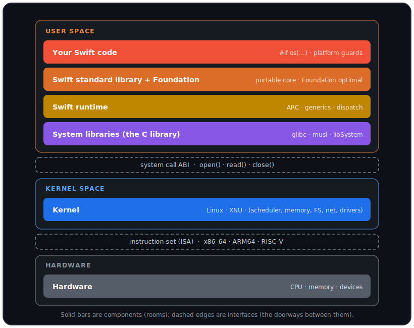

# Concepts

A top-down tour of the stack — from the Swift code you write down to the
hardware — and how the Swift ecosystem adapts at each step.



The stack has two *kinds* of thing, and keeping them apart is what makes
the picture accurate:

- **Components** (the solid bars) — actual bodies of code or hardware:
  your code, the Swift libraries, the runtime, the C library, the kernel,
  the CPU. These are grouped into three **zones**: user space, kernel
  space, and hardware.
- **Boundaries** (the dashed edges) — *interfaces*, not components. The
  **system call ABI** is the doorway from user space into the kernel; the
  **instruction set** is the contract between software and the CPU. Code
  doesn't live *in* a boundary; it crosses one.

A request travels *down* through the components and *across* the
boundaries; the result comes back up. Some of the adapting happens at
**build time** (conditional compilation, linking, cross-compilation) and
some at **run time** (calling down through the runtime and syscalls into
the kernel) — the difference is called out where it matters.

The how-to chapters — <doc:01-Conditional-Compilation>, <doc:02-Build>,
<doc:06-Cross-Compile> — apply these ideas in practice.

## User space

Everything that runs with ordinary privileges: your program and the
libraries it sits on. For each component below: **what it is**, **what
varies** across platforms, and **how Swift adapts**.

### Your Swift code

**What it is.** The source you write — the top of the stack.

**What varies.** The same source often has to differ by platform. Some
libraries exist only on one platform (`AppKit` on macOS, `Glibc` on
Linux), and some APIs have a platform-specific counterpart (`CryptoKit`
on Apple platforms, swift-crypto on Linux).

**How Swift adapts — conditional compilation (build time).** Swift picks
code at compile time based on the target, so one codebase compiles
everywhere:

```swift
#if os(macOS)
import AppKit
#elseif os(Linux)
import Glibc
#endif
```

`#if os(...)` switches on the OS, `#if canImport(...)` on whether a
module exists, and `.when(platforms:)` decides whether a package
dependency is even linked. These guards are the subject of
<doc:01-Conditional-Compilation>.

### Swift standard library + Foundation

**What it is.** The **standard library** is always present and fully
portable — `Array`, `String`, `Optional`, `print()`. **Foundation** is
optional and higher-level — `Date`, `URL`, `FileManager`, `JSONEncoder`.

**What varies.** The standard library behaves identically everywhere.
Foundation does not have one implementation: on Apple platforms it's the
system framework; on Linux it's swift-corelibs-foundation, and some
networking types live in a separate `FoundationNetworking` module.

**How Swift adapts.** Foundation is one public API with platform-specific
implementations underneath. You write `FileManager.default`; Foundation
decides how to carry it out. Your code targets the API and stays the same.

### Swift runtime

**What it is.** The always-present machinery beneath the libraries:
automatic reference counting, generics and type metadata, protocol
dispatch, error handling. It exists even without Foundation.

**What varies.** Same concept everywhere, but it's a set of libraries
(`libswiftCore` and friends) that must be present to run. What differs is
**how it's delivered**: linked statically into your binary, installed
system-wide, or bundled as `.so` files beside the executable —
<doc:06-Cross-Compile> shows each choice on a Raspberry Pi.

### System libraries (the C library)

**What it is.** The platform's C library — the lowest user-space
component. `glibc` on most Linux, `libSystem` on macOS, `musl` as a
smaller alternative.

**What varies.** `glibc` vs `musl` vs `libSystem` are different
implementations of a similar POSIX surface; a binary linked against one
generally won't run against another.

**How Swift adapts.** The `Glibc`/`Darwin`/`Musl` modules expose the C
library to Swift, and the runtime and Foundation link against whichever
the target uses. **Linking** happens here (build time): combining your
code, the Swift libraries, and the system libraries into an executable,
either *statically* (baked in) or *dynamically* (loaded at launch from
`.so`/`.dylib`).

## The system-call boundary

This is an **interface, not a component** — the doorway from user space
into the kernel. When your code needs something the OS owns (reading a
file, opening a socket), the request crosses here:
`String(contentsOfFile:)` ultimately becomes `open()`, `read()`,
`close()` calls into the kernel.

**What varies.** Linux and macOS (Darwin) expose different system-call
sets and numbers, so the same high-level call lands on different syscalls
underneath.

**How Swift adapts.** You almost never cross this boundary by hand — the
C library and Foundation do it for you. The same Swift line works on both
systems because the components above route to the right syscall for the
target.

## Kernel space

### The kernel

**What it is.** The core of the OS: process scheduling, memory
management, filesystems, networking, device drivers. Applications never
touch hardware directly; they ask the kernel across the system-call
boundary.

**What varies.** Linux uses the Linux kernel; macOS uses XNU. And a
**Linux distribution** (Ubuntu, Debian, Fedora) is the kernel *plus*
system libraries, a package manager, and configuration bundled together —
the kernel is one component of it. Raspberry Pi OS, used in
<doc:06-Cross-Compile>, is a Debian distribution.

**How Swift adapts.** Swift targets an operating system and a libc, not a
kernel directly. Moving between distributions of the same kernel
(Debian ↔ Ubuntu) is usually minor — packaging and versions — while
moving between kernels (Linux ↔ XNU) is the large jump.

## The instruction set (the hardware boundary)

The second interface: the contract between software and the physical CPU
— the machine instructions, registers, and calling conventions the
processor understands. Like the syscall boundary, it's a *contract*, not
a component.

**What varies.** `x86_64` (Intel/AMD), `ARM64`/`AArch64` (Apple Silicon,
AWS Graviton, Raspberry Pi), and `RISC-V`. The difference reaches down to
the instruction used to enter the kernel — `syscall` on Linux `x86_64`,
`svc #0` on Linux `ARM64` — though both reach the same kernel.

**How Swift adapts — cross-compilation (build time).** The compiler can
emit instructions for a CPU *other* than the one it runs on. You name the
**target triple** — e.g. `aarch64-unknown-linux-gnu` (CPU `aarch64`,
vendor `unknown`, OS `linux`, environment `gnu`) — and build on a Mac for
a Pi. That's the subject of <doc:06-Cross-Compile>.

> **Cross-compilation vs emulation.** Cross-compilation *builds* for
> another CPU; the result runs there natively, no translation. Emulation
> *runs* another CPU's code through a translator, which is slower. Docker
> is neither — it's containerization that shares the host kernel, so the
> architecture must normally match (though it can add QEMU emulation to
> run a foreign one).

## Hardware

The physical CPU, memory, and devices the instruction set describes — a
Mac, a Linux server, a Raspberry Pi. Everything above eventually executes
here, and Swift reaches it only through all the layers above; you never
address it directly.

## What can ship with your binary

A natural question once you see the stack: of all these pieces, which can
you put *in* (or *beside*) your executable, and which must already exist
on the machine you run on?

The dividing line is the **user/kernel boundary** — the green bracket in
the diagram. Everything in user space can travel with your app;
everything from the kernel down belongs to the target.

| Piece | Ships with your app? | How |
|---|---|---|
| Your code | always | compiled into the binary |
| Swift standard library **+ runtime** | yes | the runtime isn't a separate file — it lives in `libswiftCore` with the standard library |
| Foundation | yes | additional libraries (`libFoundation`, …) |
| C library (libc) | only with **musl** | glibc can't be cleanly static-linked, so on glibc it stays dynamic and comes from the target |
| Kernel · syscalls · hardware | never | provided by the machine; reached across the boundaries |

So the three "Swift library" components — standard library, runtime, and
Foundation — are all fully shippable, and in practice they're the same
bundle of `.so` files. You can either bake them into the binary
(`--static-swift-stdlib`) or ship them beside it. The only awkward piece
is the **C library**: bundleable with musl, system-provided with glibc.

That's exactly why the cross-compile chapter has three deployment modes
(<doc:06-Cross-Compile>):

- **Fully static (musl)** — bundle *everything*, libc included → one
  self-contained file, nothing required on the target.
- **Static stdlib (glibc)** — bake in the Swift libraries, leave libc
  dynamic (from the target).
- **Bundled-runtime (glibc)** — ship the Swift `.so`s beside the binary,
  use the target's libc.

## The stack vs. the axes of change

The stack above is *where code runs*. It's a different question from
*what changes when you move* — and the things that change are not
themselves layers. They're independent axes:

| Axis | Example move | How Swift adapts | Size of the jump |
|---|---|---|---|
| **CPU architecture** | `x86_64` → `ARM64` | cross-compilation (target triple) | small — swaps instructions |
| **Operating system** | Linux → macOS | different libc, syscalls, kernel, Foundation impl | **large** |
| **Distribution** | Ubuntu → Debian | usually just rebuild | smallest — packaging/versions |
| **C library** | glibc → musl | relink against the other libc | medium — affects the binary's deps |

So `x86_64` and `Debian` aren't rungs on the ladder — they're *values*
you pick on orthogonal axes, and each axis has its own Swift mechanism.

Pure Swift — the standard library, your algorithms — travels freely
across all of them. The friction is always at the lower components:
files, networking, processes, security. The whole reason it works is that
the compiler, runtime, Foundation, and linker each carry platform-specific
pieces selected for your target, while the code you write stays mostly the
same.

### Aside: the compiled binary

Off the stack for a moment — the executable those components produce has
internal sections: code, constants, data, a symbol table, and debug
information. Debug info maps a machine address back to a source file,
line, and variable names, so a debugger can show `main.swift:42` instead
of `0x10423F810`. A release build often *strips* the debug sections for a
smaller, faster-loading binary that's harder to reverse engineer — still
one file, just without the debug data.
